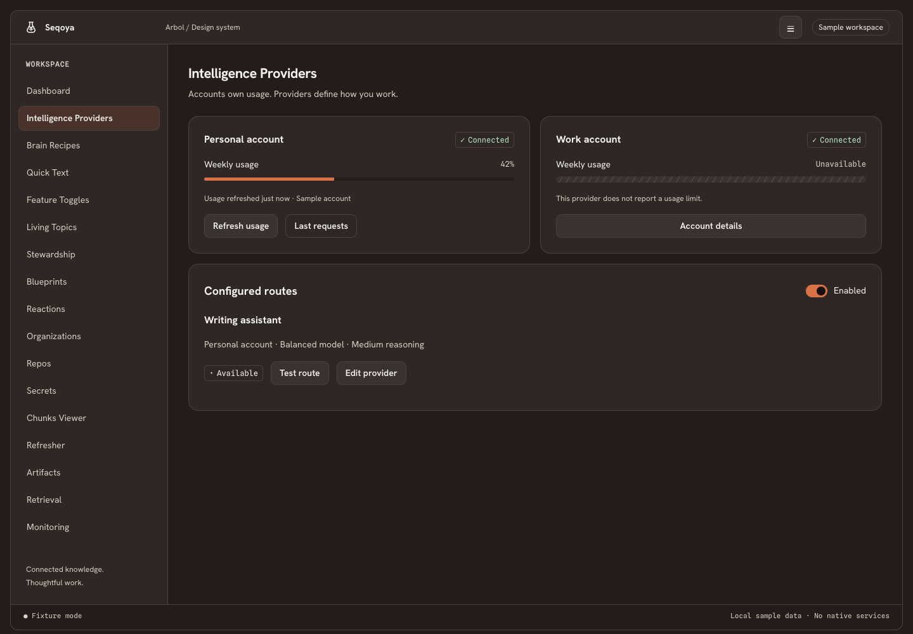

# Arbol Design System

A standalone, interactive design reference for rebuilding Arbol's interface in a new codebase. It preserves the warm wood themes and the identities of **Seqoya, Elma, Willo and Oaken**, while consolidating collections, entity editors, dialogs and other shared interactions.

## Run Storybook

Requires Node.js 22.12 or newer.

```sh
npm ci
npm run storybook
```

Open **http://localhost:6006**. Browse individual components, shared patterns, reusable sections, complete pages, native surface specifications and original design evidence. The toolbar switches all twelve themes, density and text size. All data is fictional; actions change local preview state.

```sh
npm run check
npm run build
npx playwright install chromium
npm test
```

`npm run preview` serves the static build locally. If Chromium is already installed as Google Chrome, use `PLAYWRIGHT_CHANNEL=chrome npm test` instead of installing another browser.

The catalog contains **229 stories**, **72 reusable components/patterns/sections**, and **47 page examples**.

## What is included

- Independently browsable primitives, interaction patterns and workspace sections, with loading, empty, error, editing, permission and density variants.
- Every documented Seqoya, Elma, Willo, Oaken and detached-document destination.
- Twelve wood themes, bundled fonts, semantic tokens and the 24-kind entity registry.
- Browser specifications for the native palettes, quick input, tray, notification, permission and diagnostic surfaces.
- The full [Design System chapter](docs/design-system/README.md), rendered inside Storybook as **Design contracts**.
- [Original source coverage](docs/LEGACY-COVERAGE.md), the verified UI archive, captures, and selected interactive legacy components.



## Reuse and extend

The successor implementation lives in `src/components`, `src/patterns`, `src/sections` and `src/pages`. The public source barrel is `src/index.ts`; shared styling is `src/styles/tokens.css` and `src/styles/system.css`. There is no dependency on the original Arbol checkout.

Read [implementation decisions and boundaries](docs/IMPLEMENTATION.md) before adapting these components to production. See [design coverage](docs/COVERAGE.md) for the chapter-to-catalog map. The original code in `heritage/` is reference evidence, not the successor API.

A ready-to-use [GitHub Actions workflow](docs/ci/storybook.yml) builds, tests and uploads the Storybook bundle. It is stored as a template because the available `gh` token lacks the `workflow` scope required to publish active workflows. To enable it with suitable credentials, copy it to `.github/workflows/storybook.yml` and push. This private repository does not automatically publish a public website.

Font redistribution notices: [Hanken Grotesk](docs/licenses/Hanken-Grotesk-OFL.txt) and [Spline Sans Mono](docs/licenses/Spline-Sans-Mono-OFL.txt).
