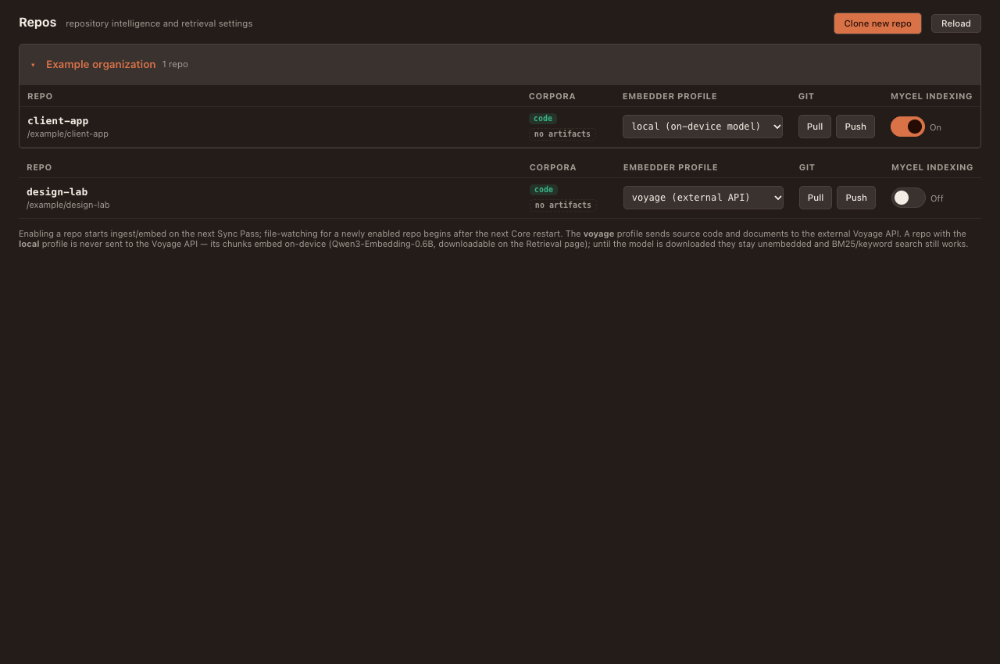

# Seqoya Lab

## Observed structure

Administration workspace with shared shell, a left navigation/insignia panel and selected page. The header supplies a repository picker; repository-dependent knowledge pages require a repository context. The navigation contains **17 destinations**. Dashboard is implemented, despite the historical guide calling it a placeholder. Monitoring contains Event Stream and Journal Log; event/history inspection now lives here rather than defining Willo's current purpose.

<!-- sources:
arbol:renderer/apps/seqoya/src/App.svelte
arbol:renderer/apps/seqoya/src/nav/NavigationPanel.svelte
arbol:renderer/apps/seqoya/src/pages/Dashboard.svelte
arbol:renderer/apps/seqoya/src/pages/Monitoring.svelte
-->

## Page inventory and successor mapping

| Destination | Observed UX and actions | Proposed common pattern |
|---|---|---|
| Dashboard | Knowledge health, recent activity, shortcut to providers | Overview cards; honest freshness and actionable failures |
| Intelligence Providers | Subscription usage rows; configured provider cards; enable/disable, Test and Edit | Two related collections, keeping account and route distinct |
| Brain Recipes | Global fallback, recipes, create/edit dialog, ordered conditional assignments and delete confirmation | Collection + full-page rule editor; explicit priority/order |
| Quick Text | Shortcut/content rows; enable, edit, delete; custom popup form; `!@` activation keys | Collection + medium EntityEditor; preview insertion behavior |
| Feature Toggles | Feature cards and Cue Detection Catalog | Settings list with scope, current state and reason |
| Living Topics | Create/edit fields, expandable topic cards, Chat, link/unlink entity, delete | Collection + DetailPane with relations |
| Stewardship | Activation Rules, Stewards and Mandates; mission, metadata, instruction files, held permissions and definitions | Readable grouped inspectors; separate authority from runtime status |
| Blueprints | Inline typed contract editor with inputs, outputs, recipes, restrictions, done-when and Markdown instructions | Collection + full-page structured document editor |
| Reactions | Signal automation summaries | Read-only collection/detail unless editing is actually supported |
| Organizations | Create/edit organization; root/URL/fork identity; repo grouping, VIP/ignored; pull/push and progress | Collection + organization editor + nested RepoCollection |
| Repos | Standalone/organization repositories; corpora, embedder profile, Git and indexing; clone flow | Comparable table + Clone operation dialog |
| Secrets | Provider/integration credentials, configuration, connection checks and Telegram sign-in steps | Credential settings with concealed input + explicit connection state |
| Chunks Viewer | Repository corpus records with current-page text filtering | Table + inspector, visibly scoped search |
| Refresher | Open drift/freshness information and refresh operations | Issue collection + progress/detail |
| Artifacts | Corpus file tree, rendered document/editing, refresh and context actions | Tree + shared DocumentView |
| Retrieval | Embedding status/actions, RAPTOR planning/run controls, text and code search | Operation panels + result collection; costs/scope before a run |
| Monitoring | Activity/history table and journal table; filters and detail payloads | Shared log-table/inspector recipe |

These rows summarize actual page surfaces; they do not claim all remote operations currently succeed. Exact fields/actions and page-local styles are retained in the source archive.

<!-- sources:
arbol:renderer/apps/seqoya/src/pages/BrainRecipes.svelte
arbol:renderer/apps/seqoya/src/pages/QuickText.svelte
arbol:renderer/apps/seqoya/src/pages/FeatureToggles.svelte
arbol:renderer/apps/seqoya/src/pages/LivingTopics.svelte
arbol:renderer/apps/seqoya/src/pages/Stewardship.svelte
arbol:renderer/apps/seqoya/src/pages/Blueprints.svelte
arbol:renderer/apps/seqoya/src/pages/Reactions.svelte
arbol:renderer/apps/seqoya/src/pages/Organizations.svelte
arbol:renderer/apps/seqoya/src/pages/Repos.svelte
arbol:renderer/apps/seqoya/src/pages/Secrets.svelte
arbol:renderer/apps/seqoya/src/pages/ChunksViewer.svelte
arbol:renderer/apps/seqoya/src/pages/Refresher.svelte
arbol:renderer/apps/seqoya/src/pages/Artifacts.svelte
arbol:renderer/apps/seqoya/src/pages/Retrieval.svelte
arbol:renderer/apps/seqoya/src/pages/EventMonitor.svelte
arbol:renderer/apps/seqoya/src/pages/LogJournal.svelte
-->

## Provider/account workflow to preserve

A subscription is an account/authentication/usage unit; a configured Intelligence Provider is a route using one subscription. Preserve the distinction even if labels simplify to Accounts and Providers. Subscription rows have provider-dependent login/logout, refresh, usage meters and expandable last-request information. IP cards show route information and testing state. Existing IPs are edited; the observed settings workflow is not a general provider-creation UI.

The IP editor includes subscription binding; global default; default/prohibited repositories; default model; available models and enabled thinking levels; and full permissions. It can fetch model catalogs and retain saved values. Repository default/prohibited conflicts are exposed, with prohibited winning. Saving currently submits IP settings and repository rules separately; the successor must provide atomic save or explicit partial-success recovery. A generic “saved” message must not hide that distinction.

Proposed field order: Identity/account → Model and reasoning → Repository routing → Advanced permissions. Put the model catalog into an editor section/page rather than a large popup within a popup. Model availability and capability come from provider data, not a frozen design-system enum. Preserve recognizable historical provider labels only for archived records when a route is retired.

<!-- sources:
arbol:renderer/apps/seqoya/src/pages/IntelligenceProviders.svelte
arbol:renderer/apps/seqoya/src/pages/SubscriptionRow.svelte
arbol:renderer/apps/seqoya/src/pages/IpCard.svelte
arbol:renderer/apps/seqoya/src/pages/ip-edit/IntelligenceProviderEditModal.svelte
arbol:renderer/packages/design-system/src/providers.ts
-->

## Proposed navigation and layout

Group destinations under Intelligence (Providers, Recipes), Workspace (Organizations, Repos, Quick Text, Living Topics), Automation (Blueprints, Stewardship, Reactions), Knowledge (Artifacts, Chunks, Refresher, Retrieval), and System (Dashboard, Secrets, Feature Toggles, Monitoring). Grouping does not change entity ownership. Keep global settings visibly global; show repository scope only where meaningful.

Use the standard collection toolbar and editor hosts. Primary New/Create sits in the page header. Refresh is secondary. Editing a row should preserve its collection filter and selection, with a Back/Cancel path that returns to the same record. Lengthy Blueprints and recipes get full pages; short Quick Text and organization identity use dialogs. Credential input never displays a saved secret; show “Configured”, replace and remove actions with clear result feedback.

## Restoration scenarios

Test one account unavailable, usage unknown, expired authentication, provider test failure, unknown saved model, conflicting repo rules, partial settings save, failed clone/pull, duplicate organization name, missing artifact, stale knowledge results and a long recipe with reordered rules. The view must preserve unsaved work and distinguish missing data from a real zero.

## Captured visual reference

Current Repos component with fictional data; theme applied by the capture harness, without app shell.

Compare the separately authored [successor specimen](reference.html) and see [capture provenance](assets/README.md).
