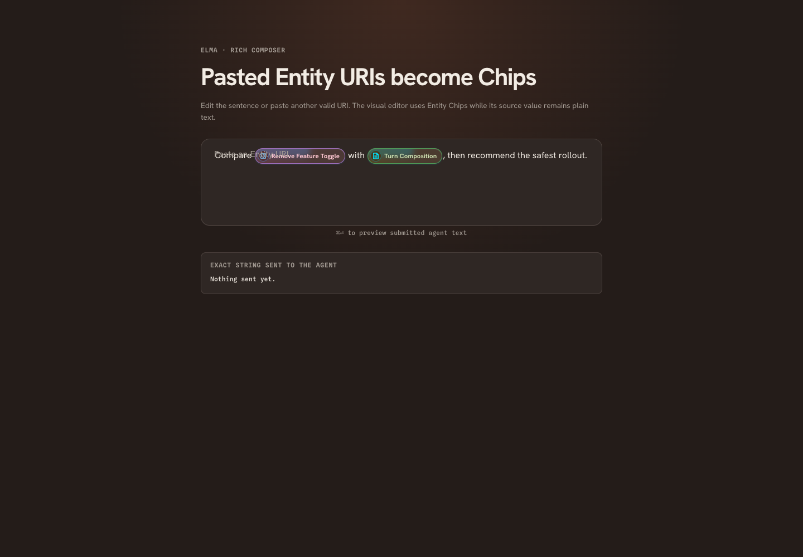

# Elma Chat

## Observed composition

Elma is a turn-oriented conversation workspace, not simply a scrolling messaging app. A navigation rail exposes repositories, turn-history controls, intelligence settings and Meta Cockpit. The main page combines context, the selected user message, assistant response, live state and composer. Turn and branch controls choose the visible path. A right pane shows a file/document or Thread Inspector; it may become fullscreen. Shared header/status chrome surrounds the workspace.

An empty chat uses a larger composer. Active chat uses a smaller composer with collapse/expand behavior. Response content has its own scroll region and reading-width limit. Elma separately persists UI scale, response scale and reading width.

<!-- sources:
arbol:renderer/apps/elma/src/App.svelte
arbol:renderer/apps/elma/src/pages/ElmaPage.svelte
arbol:renderer/apps/elma/src/nav/NavigationPanel.svelte
arbol:renderer/apps/elma/src/nav/MetaCockpit.svelte
arbol:renderer/apps/elma/src/chat/ResponseView.svelte
arbol:renderer/apps/elma/src/chat/SplitColumns.svelte
-->

## Surface inventory

| Surface | What must survive reconstruction |
|---|---|
| Header/title and status | Named chat, workspace identity, live status, preferences and readable diagnostics |
| Repository navigation | New-chat shortcuts, folder choice, current working context; current code distinguishes click changing context from shortcut starting a chat |
| Intelligence controls | Provider, model and thinking selection; unavailable/retired route handling |
| Meta Cockpit | Session metadata, tags, parent reference and ongoing state |
| Context strip / attachments | Repository/route/model and attached entities, notes/images; removability before sending |
| Composer | Multiline draft, entity tokens, paste handling, image previews, send shortcut and retained draft |
| Pinned message / turn stepper | Current prompt, older/newer turns, selected turn index and jump history |
| Branch controls | Switch sibling branches, compose from a chosen point, pin/remove actions and consequence confirmation |
| Response | Markdown, code/tables, thinking blocks, tool rows, lifecycle messages and final answer cues |
| Approval dock | Tool decisions and structured user questions; pending/busy/resolved states |
| Agent status | Active work, waiting, failure explanation, Retry and Continue from failure point |
| View Page / SidePanel | Local file, Markdown/frontmatter/Blueprint presentation, copy path, edit, save state, back/forward, fullscreen and detach |
| Thread Inspector | Session/turn diagnostics; preserve as explicit advanced view |
| Activity graph / lifecycle log | Execution and relationship inspection; separate from ordinary response prose |
| History overlay | Branch/turn navigation without losing draft or reading position |
| Quick Actions / tagging | Searchable actions, tags and acknowledgment |
| Change Walkthrough | Target chooser, file rail, before/diff/with-changes modes, whitespace/context controls and ask-agent-about-selected-lines |
| Worktree diff mode | Existing alternative diff entry points retained in archive; do not infer future worktree architecture from this UI |

<!-- sources:
arbol:renderer/apps/elma/src/chat/Composer.svelte
arbol:renderer/apps/elma/src/chat/EntityComposerInput.svelte
arbol:renderer/apps/elma/src/chat/AttachedContext.svelte
arbol:renderer/apps/elma/src/chat/PinnedMessage.svelte
arbol:renderer/apps/elma/src/chat/TurnStepper.svelte
arbol:renderer/apps/elma/src/chat/branching/BranchSwitcher.svelte
arbol:renderer/apps/elma/src/chat/HistoryOverlay.svelte
arbol:renderer/apps/elma/src/chat/ApprovalDock.svelte
arbol:renderer/apps/elma/src/chat/AskUserQuestionCard.svelte
arbol:renderer/apps/elma/src/chat/AgentStatusBar.svelte
arbol:renderer/apps/elma/src/chat/SidePanel.svelte
arbol:renderer/apps/elma/src/chat/ThreadInspector.svelte
arbol:renderer/apps/elma/src/chat/ActivityGraphPanel.svelte
arbol:renderer/apps/elma/src/change-walkthrough/ChangeWalkthroughPage.svelte
arbol:renderer/apps/elma/src/WorktreeDiffMode.svelte
-->

## Composer and continuity details

Observed image paste accepts PNG, JPEG, WebP and GIF, up to four images and 8 MiB per image in the composer. Large text paste has a separate temporary-file/link path. Entity-aware text and Chat Note paste preserve structured context. Send is Cmd/Control+Enter; ordinary multiline editing remains available. These numeric limits are historical product constraints, not timeless design tokens.

Drafts are associated with composer/chat identity, not merely a repository. Preserve draft text and attachments across switching, refresh and failure. A failed send must not erase the only copy. Retry reloads persisted image bytes and stops on attachment failure instead of silently sending incomplete content. Read receipts must refer to the displayed chat/projection, not whichever chat a stale request originally targeted.

<!-- sources:
arbol:renderer/apps/elma/src/chat/Composer.svelte
arbol:renderer/apps/elma/src/chat/largeTextPaste.ts
arbol:renderer/apps/elma/src/chat/chatNoteClipboard.ts
arbol:renderer/apps/elma/src/app/draft-cache.ts
arbol:renderer/apps/elma/src/app/message-attachments.ts
arbol:renderer/apps/elma/src/app/read-receipt.ts
-->

## Proposed improvements

Keep turn/branch navigation, but label the selected branch and the consequence of editing an earlier turn. Offer a continuous transcript presentation as an optional future feature, not a prerequisite for restoring Elma. Do not conflate “new chat in repo” with “change this chat's working directory”: give them distinct visible actions; preserve shortcuts as accelerators only.

Move provider/model/thinking into one consistent Context bar, with advanced routing and permissions disclosed on demand. Put parent/ongoing metadata in a stable inspector section rather than allowing inherited state to look like the child's own execution state. Preserve tool detail for investigation, but default to concise status rows and a readable answer.

Use the shared PermissionRequest and ConfirmAction patterns. Require deliberate activation for destructive branch removal; keep its downstream-turn consequence in the confirmation. Separate Stop, Retry and Continue labels; specify whether retry creates a replacement turn or resumes a prior attempt. Keep task state authoritative and show “Status unavailable” rather than pretending to run indefinitely.

Unify SidePanel and the detached artifact window around DocumentView. Both should share navigation, find, copy path, dirty-state protection and save-error handling. The current SidePanel uses autosave state while the detached renderer exposes explicit saving; choose a documented policy and maintain it across both hosts.

<!-- sources:
arbol:renderer/apps/elma/src/nav/NavigationPanel.svelte
arbol:renderer/apps/elma/src/nav/MetaCockpit.svelte
arbol:renderer/apps/elma/src/pages/ElmaPage.svelte
arbol:renderer/apps/elma/src/chat/SidePanel.svelte
arbol:renderer/apps/artifact/src/App.svelte
-->

## Layout and acceptance

Preserve the 720 px default reading column; let it shrink to its container and allow the user to widen it. The code's 600 px preference minimum must not force the entire window to overflow. On constrained widths, the inspector replaces the main area with Back to chat; the composer remains reachable when keyboard or text size changes.

Acceptance: fresh chat; long multiline draft; mixed entity/image context; failed attachment; retry; streaming while reading older output; branch switch with unsent draft; user question; tool permission resolved in another window; failed/stale execution; file autosave error; large diff; deleted file; narrow window; 200% text; reduced motion. Use the existing E2E fixtures as behavior references, not proof of the successor's correctness.

<!-- sources:
arbol:renderer/apps/elma/src/app/chat-width.ts
arbol:renderer/apps/elma/e2e/response-autoscroll.e2e.mjs
arbol:renderer/apps/elma/e2e/draft-session-switch.e2e.mjs
arbol:renderer/apps/elma/e2e/side-panel-autosave.e2e.mjs
-->

## Captured visual reference

Current entity-composer Storybook fixture; this is a component view, not the entire chat window. The captured fixture shows overlapping text at the start of its input; this is retained as legacy evidence, not a target treatment.

Compare the separately authored [successor specimen](reference.html) and see [capture provenance](assets/README.md).
