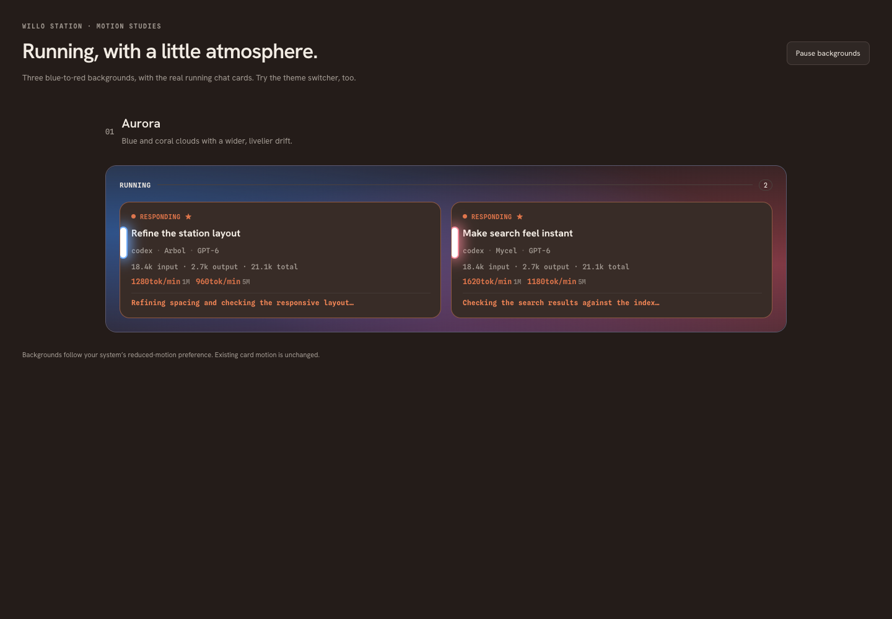

# Willo Station

## Observed purpose and structure

Willo is the attention and communications workspace. Current navigation offers Stations, Agentic Stations, Stewards, Comunicados, Slack, Telegram, conditionally Emails, and Blueprint Runs; selecting a run opens Run Details. This is materially broader than an event monitor. Native Go to Page is a separate list and omits Telegram in the inspected checkout—an example of navigation registries drifting apart.

Full view uses shared chrome, navigation/presentation controls, station content and an attention column. Stations are grouped as Drafted, Running, Unread, Other on-going and Other chats. Human/legacy-origin chats and standalone drafts belong to Stations; agent-origin chats have their own page. Stewards is a narrower view. Presentation settings and pagination alter density; compact Keep on Top and minimal compact modes serve ambient monitoring.

<!-- sources:
arbol:renderer/apps/willo/src/App.svelte
arbol:renderer/apps/willo/src/willo.css
arbol:app/Arbol/GoToPage.swift
-->

## Station recipe

Observed full and compact station components carry title editing, status, failure and image cues, activity information, live output tail, usage and metadata. The active chat in Elma has a distinct cue. Cards support opening in Elma and context actions. Search in the station implementation is explicitly bounded to the current page. Pagination must therefore not imply global transcript search.

**Proposed:** one StationSummary renders full/card, row and compact variants from one state adapter. Put title first, then execution state and unread/ongoing badges, then useful preview and repository/provider metadata. Keep usage and timestamps secondary. Preserve the text of a failure and its recovery action. Never equate “ongoing” (user/workflow intent), “running” (execution), “unread” (attention) and “open in Elma” (navigation).

For inherited parent state, indicate “Ongoing via parent” and link the owner. Do not silently make a child's execution look identical to its parent's. Full and compact modes use the same commands and state, with fewer visible details in compact mode. An explicit expand/open action returns to the corresponding record.

<!-- sources:
arbol:renderer/apps/willo/src/StationCard.svelte
arbol:renderer/apps/willo/src/CompactStationCard.svelte
arbol:renderer/apps/willo/src/SessionTitleEditor.svelte
arbol:renderer/apps/willo/src/SessionFailureCue.svelte
arbol:renderer/apps/willo/src/SessionImageIndicator.svelte
arbol:renderer/apps/willo/src/App.svelte
arbol:renderer/apps/willo/src/PaginationControls.svelte
-->

## Attention and notification controls

The AttentionColumn separates **Action Items**, which ask for a response, from **Spotlight**, which holds deliberately retained entities. It supports opening, closing/removing, spotlighting and permission decisions. Comunicados page configures species and tests notification delivery; it is not the same surface as the active attention inbox. Permission actions also appear in Elma and native panels.

**Proposed:** use a persistent attention list with explicit request state and origin. Closing a visual notification is distinct from rejecting its request. Removing a Spotlight entry is distinct from deleting its entity. Resolution synchronizes across windows; disable obsolete decisions and show the outcome. Configuration/test tools belong in settings, while the inbox concentrates on user work.

<!-- sources:
arbol:renderer/apps/willo/src/AttentionColumn.svelte
arbol:renderer/apps/willo/src/ComunicadosPage.svelte
arbol:renderer/packages/design-system/src/components/PermissionDecisionActions.svelte
-->

## Source inboxes

| Surface | Observed information architecture | Preserve / improve |
|---|---|---|
| Slack | Contacts, Channels, Ignored; VIP ordering; conversation selection, messages/thread expansion, older messages; copy, spotlight and create Graft | Shared SourceInbox shell; keep thread semantics; explicit sync freshness |
| Telegram | Contacts, Chats, Ignored; VIP order, search by number/name, conversation timeline, older ranges and sync | Same source-list/detail mechanics; source-specific labels and range controls |
| Emails | Account selection, synchronized thread filter, pinned/read cues, pagination, selected message/source content, sync and automation menu | Same selection and list states; distinguish cached metadata from fetched content |
| Email automation | Ignore confirmation/string rules, ignored sources manager, parser test, Signal Rule create/edit/test, rules manager | Shared editor/confirm hosts; retain sample/test results and future-only activation semantics |

These are source-reading/curation workflows. Do not infer that they have arbitrary message-send functionality. A future outbound composer requires its own explicit design and confirmation of delivery scope.

Email Signal Rules have a test-before-save flow and future-only applicability. The historical form explicitly says that testing a retained email does not emit a Signal. Preserve this distinction: “Test” is preview, “Create rule” changes future behavior. Scope ignore actions by sender/thread/string as actually supported; show affected scope before applying and make recovery discoverable in Ignored sources.

<!-- sources:
arbol:renderer/apps/willo/src/SlackPage.svelte
arbol:renderer/apps/willo/src/SlackMessageView.svelte
arbol:renderer/apps/willo/src/TelegramPage.svelte
arbol:renderer/apps/willo/src/EmailsPage.svelte
arbol:renderer/apps/willo/src/EmailContextMenu.svelte
arbol:renderer/apps/willo/src/EmailSignalRuleModal.svelte
arbol:renderer/apps/willo/src/EmailParserTestModal.svelte
arbol:renderer/apps/willo/src/IgnoreEmailConfirmModal.svelte
arbol:renderer/apps/willo/src/IgnoreEmailStringModal.svelte
arbol:renderer/apps/willo/src/IgnoredEmailSourcesModal.svelte
arbol:renderer/apps/willo/src/SignalRulesManagerModal.svelte
-->

## Runs and proposed information hierarchy

Blueprint Runs lists invocations most recent first; Run Details displays run identity/status and paginated detail content. Use Collection + DetailPane with an explicit return path. A running invocation is an operation, not necessarily a chat; link its related chat without substituting one identity for the other.

Proposed navigation groups: Work (Stations, Agentic, Stewards), Attention (Action Items, Spotlight), Sources (Slack, Telegram, Emails), History (Runs); notification settings move to a settings destination. These are design choices for the successor, not claims about the existing nav. Avoid showing empty unsupported integrations before setup; offer Connect sources in an intentional onboarding state.

<!-- sources:
arbol:renderer/apps/willo/src/BlueprintRuns.svelte
arbol:renderer/apps/willo/src/RunDetails.svelte
-->

## Acceptance

Exercise a draft-only station, running chat, unread completion, failed attempt, inherited ongoing state, active-in-Elma cue, rename error, current-page search, pagination after filtering, reconnect with stale cards, compact/full switching, external permission resolution, missing source content, ignored source recovery and a failed sync that preserves the selected conversation. Animation may add atmosphere but must not be required to recognize activity.

## Captured visual reference

Source Aurora presentation study using station cards; not evidence that this is the default installed appearance.

Compare the separately authored [successor specimen](reference.html) and see [capture provenance](assets/README.md).
